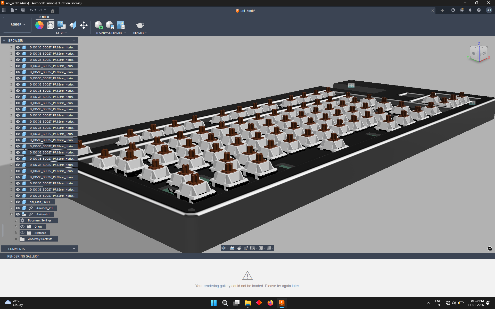
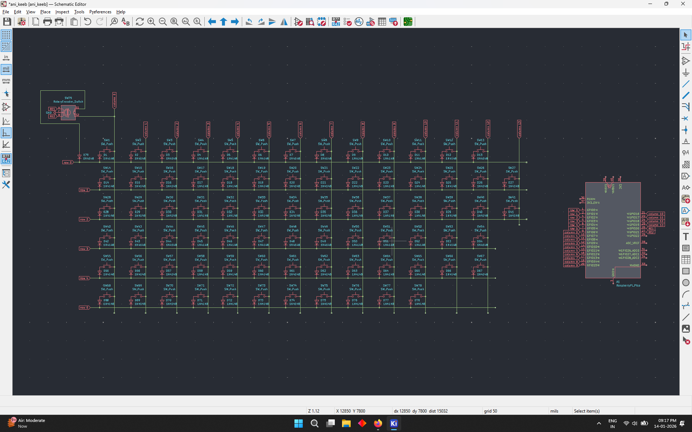
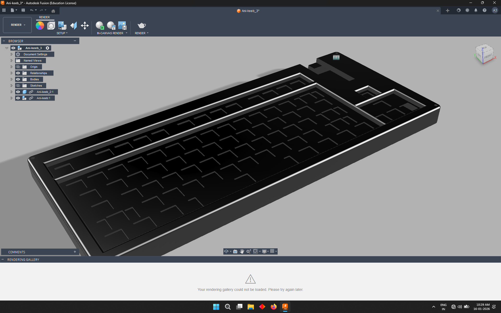
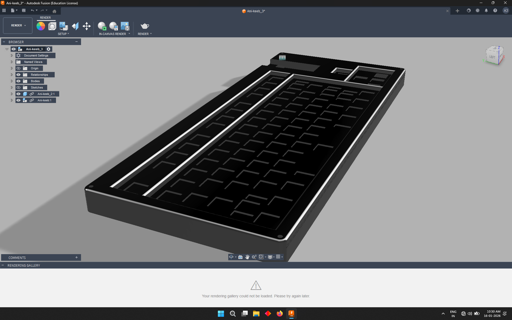
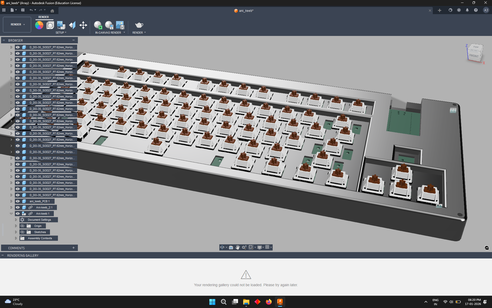

# Ani-keeb

### Why did I make it?
It was a project of blueprint but i just never completed it. and like i almost went offline from hackclub then i heard about Reboot. that's why i built it and completed it.

Features:

- Raspberry Pi Pico
- Customised layout
- QMK firmware
- cool silkscreen
- Custom case

### Schematic

### PCB 

### Case

### 3D view of all parts together 

